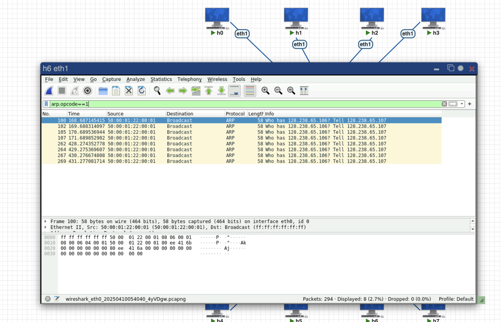
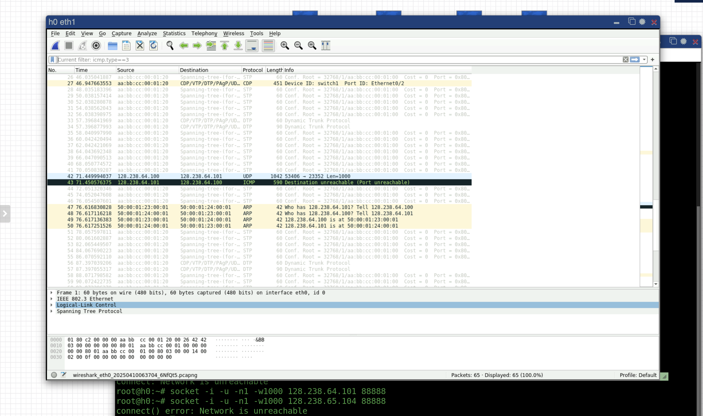
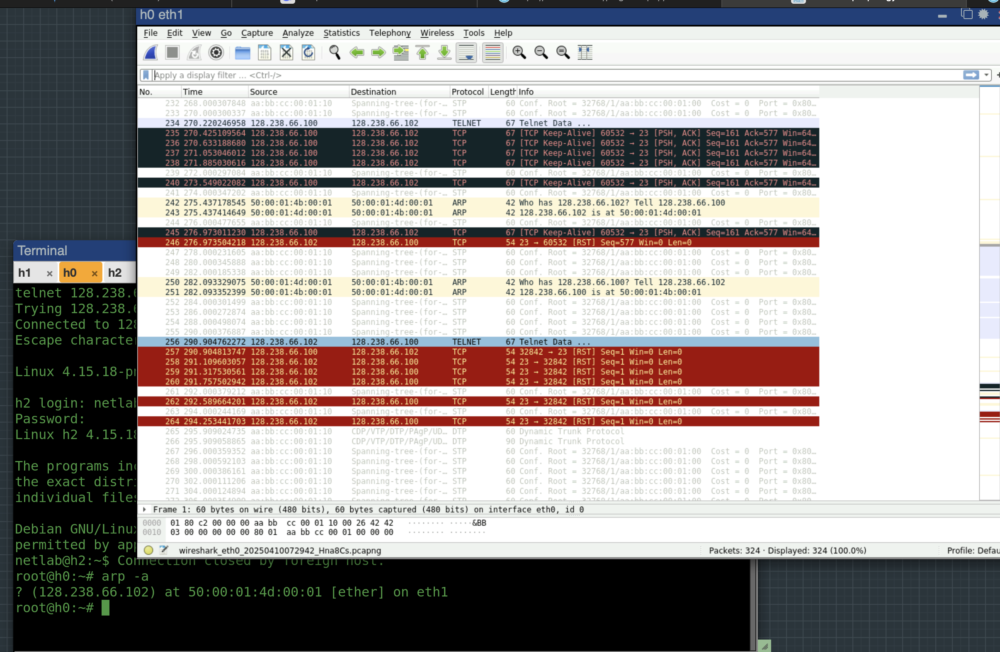
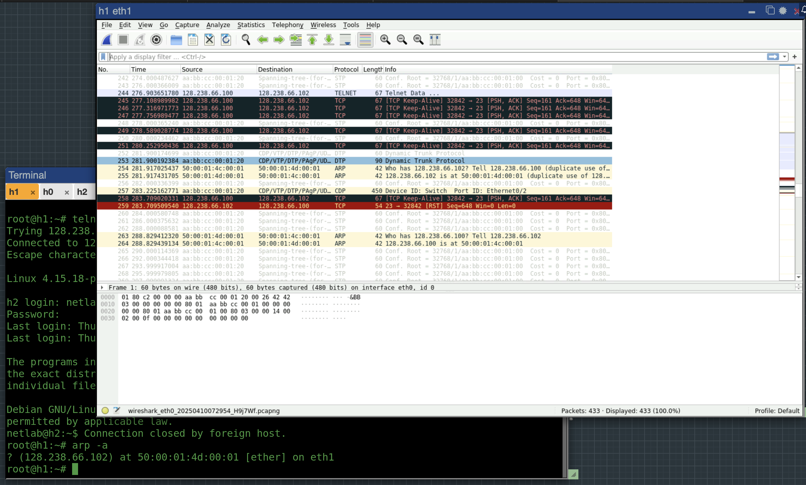
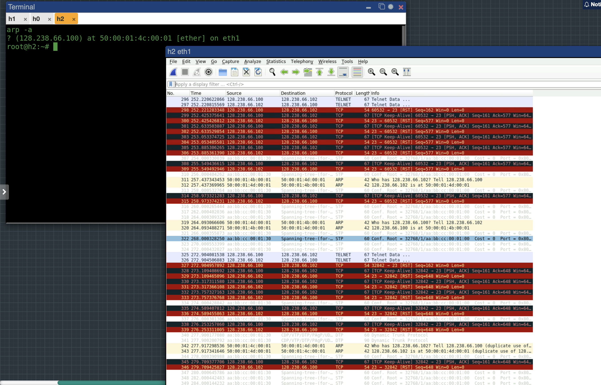
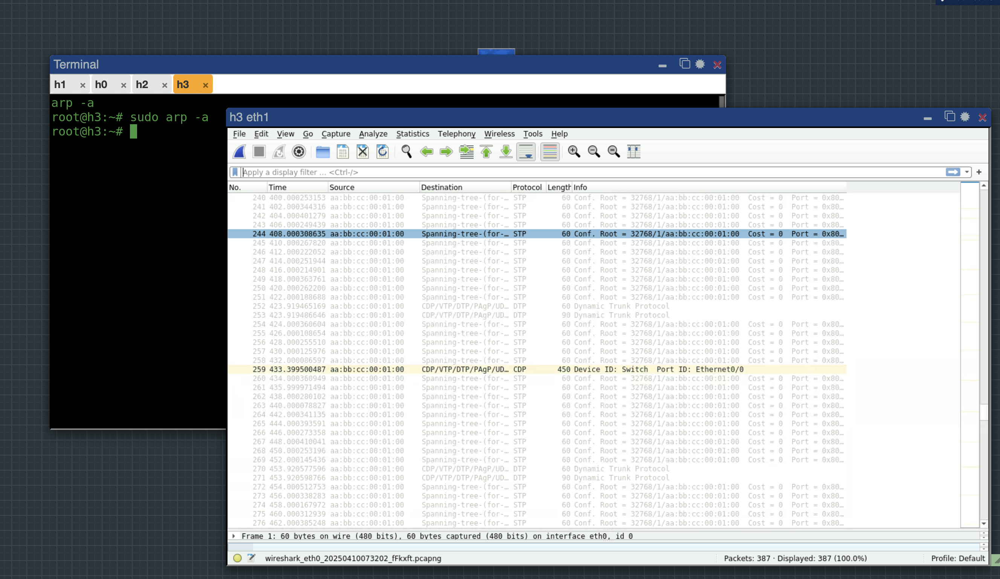

# Report 1
___
## 1. How many interfaces does the host have? List all the interfaces found, give their names, and explain their functions briefly.
## 2. What are the MTUs of the interfaces on h0?
* Total Interfaces Found: 4

Active Interfaces:

| Interface | IP Address     | Netmask       | MTU   | Status | Function                     |
|-----------|----------------|---------------|-------|--------|------------------------------|
| eth0      | 10.177.0.67    | 255.255.0.0   | 1500  | UP     | Primary Ethernet (Class B)   |
| eth1      | 128.238.66.100 | 255.255.255.0 | 1500  | UP     | Secondary Ethernet (Class C) |
| lo        | 127.0.0.1      | 255.0.0.0     | 65536 | UP     | Loopback (internal comms)    |

Inactive Interfaces:

| Interface | MTU  | Status | Function              |
|-----------|------|--------|-----------------------|
| docker0   | 1500 | DOWN   | Docker virtual bridge |

## 3. Is network subnetted? What is the reasoning for your answer? What the experimental are the reasons for subnetting?
* Yes, based on Different Network Classes:
  - eth0: 10.177.0.67/16 (Class B private range)
  - eth1: 128.238.66.100/24 (Class C public range)
  
| Reason                 | Technical Benefit            |
|------------------------|------------------------------|
| **Traffic Isolation**  | Reduces broadcast domains    |
| **Security**           | Limits attack surface        |
| **Address Efficiency** | Optimizes IP usage           |
| **Protocol Testing**   | Enables parallel experiments |
| **QoS Management**     | Prioritizes critical traffic |

# Report 2
___
## 1. From the ping output, is the 127.0.0.1 interface on? Can you see any ICMP message sent from your host in the tcpdump output? Why?
* Successful ping replies confirm the interface is working
* ICMP messages are visible in tcpdump 
* When we execute ping 127.0.0.1, the kernel creates real ICMP packets (Echo Request)

# Report 3
___
## 1. Calculate the average collision rate over all the hosts for the set of statistics you collected in this exercise.
* Total collisions = 0 (eth0 on host 1) + 0 (eth1 on host 1) + 0 (eth0 on host 2) + 0 (eth1 on host 2) = 0
* Total number of interfaces = 4
* Average collision rate = Total collisions / Total number of interfaces = 0 / 4 = 0

# Report 4
___
## 1. From the saved wireshark output, explain how ARP operates. Draw the format of a captured, ARP request and reply including each field and the value. Your report should include the answers for the following questions.
* What is the target IP address in the ARP request?
  * 128.238.66.107
* At the MAC layer, what is the destination Ethernet address of the frame carrying the ARP request?
  * Broadcast (ff:ff:ff:ff:ff:ff)
* What is the frame type field in the Ethernet frame?
  * ARP (0x0806)
*  Who sends the ARP reply?
  * Owner of the target IP

* ***ARP table before ping:***
  - ? (128.238.66.103) at 50:00:00:e1:00:01 [ether] on eth1
  - ? (128.238.66.102) at 50:00:00:db:00:01 [ether] on eth1
  - ? (128.238.66.106) at 50:00:00:dd:00:01 [ether] on eth1
  - ? (128.238.66.100) at 50:00:00:09:00:01 [ether] on eth1
  - ? (128.238.66.105) at 50:00:00:de:00:01 [ether] on eth1
  - ? (128.238.66.104) at 50:00:00:df:00:01 [ether] on eth1

* ***ARP table after ping:***
  - ? (128.238.66.103) at 50:00:00:e1:00:01 [ether] on eth1
  - ? (128.238.66.102) at 50:00:00:db:00:01 [ether] on eth1
  - ? (128.238.66.107) at 50:00:00:dc:00:01 [ether] on eth1
  - ? (128.238.66.106) at 50:00:00:dd:00:01 [ether] on eth1
  - ? (128.238.66.100) at 50:00:00:09:00:01 [ether] on eth1
  - ? (128.238.66.105) at 50:00:00:de:00:01 [ether] on eth1
  - ? (128.238.66.104) at 50:00:00:df:00:01 [ether] on eth1
  
# Report 5
___
## 1. From the saved wireshark output, describe how the ARP timeout and retransmission were performed. How many attempts were made to resolve a non-existing IP address?
* Total Attempts: 6
* Delays increase between retries
* After retries, the sender marks the entry as \<incomplete> (visible in arp -a)

# Report 6
___
## 1. Explain the operation of proxy ARP.
* Proxy ARP allows a router to respond to ARP requests on behalf of hosts in different subnets, making them appear to be on the same local network. Here’s how it works:
  - Step 1: Host h5 (128.238.65.105) wants to send data to Host h0 (128.238.64.100) but doesn’t know Host h0’s MAC address.
  - Step 2: Host h5 broadcasts an ARP request: "Who has 128.238.64.100?"
  - Step 3: The router (128.238.65.4) sees the request and responds with its own MAC address (acting as a proxy).
  - Step 4: Host h5 sends packets to the router’s MAC, which then forwards them to Host h0.

## 2. Why can a host in the 128.238.65.0 subnet reach a host in the 128.238.64.0 subnet, even though they have different subnet IDs?
* Even though 128.238.64.0/24 and 128.238.65.0/16 are different subnets:
  - Proxy ARP masks the subnet separation. Hosts believe they’re on the same LAN because the router answers ARP requests for remote hosts.
  - The router handles routing. Traffic destined for another subnet is forwarded by the router, even though hosts think they’re communicating directly.

## 3. What are the MAC addresses corresponding to hosts in the 128.238.64.0 subnet, in the ARP table of a host in the 128.238.65.0 subnet?
* ca:1c:50:6e:00:1c

## 4. Give one advantage and one disadvantage of using proxy ARP.
* Advantage:
  - Simplifies network configuration: Hosts don’t need default gateways configured manually.
* Disadvantage:
  - Security risk: Routers respond to ARP requests for any IP, which can be exploited (e.g., ARP spoofing).

* ***h0 ARP table:***
? (128.238.64.4) at ca:1c:50:6e:00:00 [ether] on eth1
* ***h1 ARP table:***
? (128.238.64.4) at ca:1c:50:6e:00:00 [ether] on eth1
* ***h5 ARP table:***
? (128.238.64.100) at ca:1c:50:6e:00:1c [ether] on eth1
? (128.238.64.101) at ca:1c:50:6e:00:1c [ether] on eth1

# Report 7  
___
## 1. What is the purpose of gratuitous ARP?
* IP Conflict Detection: 
  - Checks if another host is already using the sender’s IP address (if a reply is received, a conflict exists).
* MAC Update: 
  - Proactively updates other hosts’ ARP tables with the sender’s IP-to-MAC mapping (e.g., after a reboot or IP change).
* Security Note:
  - Gratuitous ARP can be abused for ARP spoofing (attacker impersonates another host).
  
## 2. List the sender IP address, target IP address, sender MAC address, and target MAC address of the gratuitous ARP you saved.
* Sender MAC address: 50:00:01:22:00:01 (50:00:01:22:00:01)
* Sender IP address: 128.238.65.106
* Target MAC address: 00:00:00_00:00:00 (00:00:00:00:00:00)
* Target IP address: 128.238.65.106
  
## 3. What is the ARP table in h5?
* ? (128.238.64.100) at ca:1c:50:6e:00:1c [ether] on eth1
* ? (128.238.64.101) at ca:1c:50:6e:00:1c [ether] on eth1



# Report 8
___
## 1. What ICMP messages are used by ping ?
| ICMP Message                | Type | Code | Direction            | Purpose                                                   |
|-----------------------------|------|------|----------------------|-----------------------------------------------------------|
| **Echo (ping) request**     | 8    | 0    | Source → Destination | Probe if the target host is reachable ("Are you there?"). |
| **Echo (ping) reply**       | 0    | 0    | Destination → Source | Confirm reachability ("I’m here!").                       |
| **Destination Unreachable** | 3    | 0    | Router → Source      | Network Unreachable: No route to the target subnet.       |

**Silent Drops**: No reply if firewalls block ICMP or host is offline (only Echo Requests appear).

# Report 9  
___
## 1. Study the saved ICMP port unreachable error message (See Figure 2.7 of the reference book.). Why are the first 8 bytes of the original IP datagram payload included in the ICMP message?
* Protocol Identification: Helps the sender identify which application/port triggered the error.
  - The UDP header (8 bytes) contains:
    - Source/Destination Ports (2 bytes each)
    - Length & Checksum (2 bytes each)
    - This allows the sender to match the error to the original socket.
* RFC Compliance:
  - Defined in RFC 792 (ICMP specification) to provide minimal context without resending the entire packet.
* Debugging:
  - Enables tools like traceroute to work (uses UDP with incremental TTLs and analyzes ICMP errors).



# Report 10
___
## 1. Can you see any traffic sent on the network? Why? Explain what happened from the ping output.
* The source host (h2) first checks its routing table before sending any packets. If there's no valid route to network 128.238.64.0/24, the OS will:
  - Immediately fail the ping request
  - Generate an internal error (no network traffic is actually sent)

## 2. List the different ICMP messages you captured in Exercise with ICMP and ping. Give the values of the type and code fields.
| ICMP Message Type   | Type | Code | Direction            | Trigger Condition          | Observed? (✓/✗) |
|---------------------|------|------|----------------------|----------------------------|-----------------|
| Echo Request        | 8    | 0    | Source → Destination | Normal ping probe          | ✓               |
| Echo Reply          | 0    | 0    | Destination → Source | Successful ping response   | ✓               |
| Network Unreachable | 3    | 0    | Router → Source      | No route to target network | ✗ (in this lab) |
| Host Unreachable    | 3    | 1    | Router → Source      | Host down/no ARP response  | ✓               |
| Port Unreachable    | 3    | 3    | Destination → Source | UDP/TCP port not open      | ✓               |

* ***ping output***: 
  * connect: Network is unreachable

# Report 11
___
## 1. Explain what happened in the first case and why. Answer the questions for the second and third cases.

### 1. First Experiment: Dual Telnet to h2 (h0→h2 and h1→h2)
- **Initial Connection**:
  - First telnet (h0→h2) succeeds
  - ARP table on h2 shows:
    ```bash
    ? (128.238.66.100) at <h0-MAC> [ether] on eth1
    ```
- **Second Connection Attempt**:
  - h1→h2 telnet causes ARP storm
  - Results in:
    - TCP connection reset for existing session
    - Last ARP reply overwrites cache (no consistency checks)

### 2. Second Experiment: h2→128.238.66.100
* Which host responds?
  - The host whose ARP reply arrived last before telnet initiation (then h1)
* Which host provides the telnet connection?
  - h1

### 3. Third Experiment: h3→128.238.66.100
* Either h0 or h1 answers, determined by:
  - Most recent Gratuitous ARP broadcast
  - ARP request/response timing
  - Interface initialization order
```text
   Sequence:
1. h3 sends ARP for 128.238.66.100
2. Both h0 and h1 respond (race condition)
3. h3 uses first received response
4. Subsequent packets use cached MAC until timeout
   ```
* Which host is connected to h3?
  - h0







# Report 12
___
## 1. Explain what happened in each case according to the saved wireshark outputs. Explain why h3 could not be reached from other hosts, whereas h0, which has the same incorrect subnet mask, could communicate with the other hosts.

* ***Network Configuration Summary***

| Host | IP Address       | Subnet Mask       | Network ID        | Valid Host Range   | Status          |
|------|------------------|-------------------|-------------------|--------------------|-----------------|
| h0   | 128.238.66.100   | 255.255.255.240   | 128.238.66.96/28  | 96-111             | Incorrect       |
| h1   | 128.238.66.101   | 255.255.255.0     | 128.238.66.0/24   | 0-255              | Correct         |
| h2   | 128.238.66.102   | 255.255.255.0     | 128.238.66.0/24   | 0-255              | Correct         |
| h3   | 128.238.66.120   | 255.255.255.240   | 128.238.66.112/28 | 112-127            | Incorrect       |

* ***Case 1: h0 (100/28) → h1 (101/24)***
  - **Observation**: Successful bidirectional communication  
  - **Wireshark Evidence**:
    - ARP request/reply exchange visible
    - Complete ICMP Echo Request/Reply sequence
  - **Explanation**:
    1. h0 considers h1 local (101 ∈ 96-111)
    2. h1 considers h0 local (100 ∈ 0-255)
    3. Both hosts respond to each other's ARP requests

* ***Case 2: h3 (120/28) → h1 (101/24)***
  - **Observation**: No communication  
  - **Wireshark Evidence**:
    - No packets captured
  - **Explanation**:
    1. h3 considers h1 remote (101 ∉ 112-127)
    2. No default gateway → Packet dropped silently

* ***Case 3: h1 (101/24) → h0 (100/28)***
  - **Observation**: Successful communication  
  - **Wireshark Evidence**:
    - Normal ARP/ICMP exchange
    - Two-way ping traffic
  - **Explanation**:
    1. h1 considers h0 local (100 ∈ 0-255)
    2. h0 responds to ARP (101 ∈ 96-111)
    3. Symmetric communication established

* ***Case 4: h1 (101/24) → h3 (120/28)***
  - **Observation**: "Destination Unreachable"  
  - **Wireshark Evidence**:
    - ARP requests visible but no replies
    - Destination Host Unreachable generated by h1
  - **Explanation**:
    1. h1 considers h3 local (120 ∈ 0-255)
    2. h3 ignores ARP (101 ∉ 112-127)

* ***Why h0 Works But h3 Fails***

  | Factor            | h0 (100/28)          | h3 (120/28)            |
  |-------------------|----------------------|------------------------|
  | **Network Range** | 96-111               | 112-127                |
  | **Sees h1 (101)** | Local (101 ∈ 96-111) | Remote (101 ∉ 112-127) |
  | **Seen by h1**    | Local (100 ∈ 0-255)  | Local (120 ∈ 0-255)    |
  | **ARP Behavior**  | Replies to h1        | Ignores h1's ARP       |
  | **Result**        | Works asymmetrically | Fails completely       |